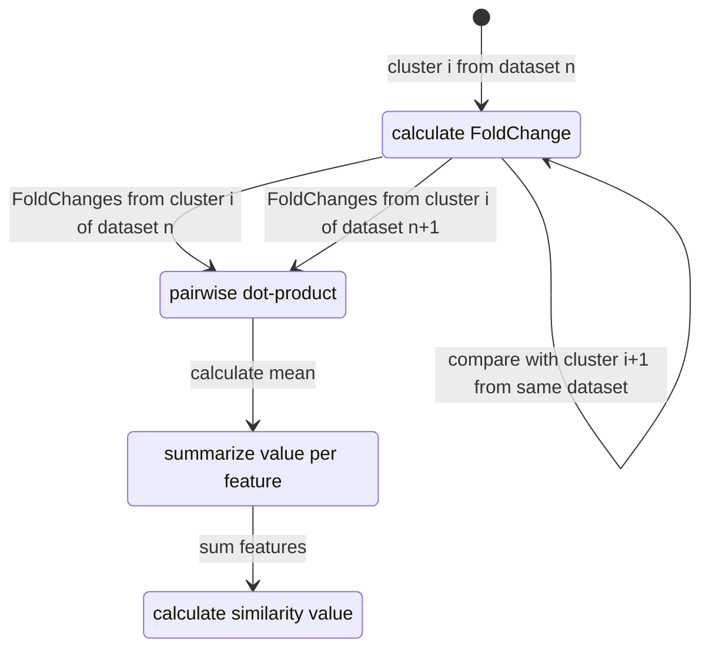

<h1> ClusterFoldSimilarity</h1>

Calculate similarities between cell-groups/clusters from any number of independent single-cell experiments, without data integration or batch correction.

# Installation

The package can be installed from R software using devtools:

```{r eval=FALSE}
library(devtools)
install_github("OscarGVelasco/ClusterFoldSimilarity")
```

# Introduction

Comparing single-cell data across different datasets, samples and batches has demonstrated to be challenging. `ClusterFoldSimilarity` aims to solve the complexity of comparing different single-cell datasets by computing similarity scores between clusters (or user-defined groups) from any number of independent single-cell experiments, including different species and sequencing technologies. It accomplishes this by identifying analogous fold-change patterns across cell groups that share a common set of features (such as genes). Additionally, it selects and reports the top important features that have contributed to the observed similarity, serving as a tool for feature selection.

The output is a table that contains the similarity values for all the combinations of cluster-pairs from the independent datasets. `ClusterFoldSimilarity` also includes various plotting utilities to enhance the interpretability of the similarity scores.

### Cross-species analysis and sequencing technologies (e.g.: Human vs Mouse, ATAC-Seq vs RNA-Seq)

`ClusterFoldSimilarity` is able to compare **any number** of independent experiments, including **different organisms**, making it useful for matching cell populations across different organisms, and thus, useful for inter-species analysis. Additionally, it can be used with **single-cell RNA-Seq data, single-cell ATAC-Seq data**, or more broadly, with continuous numerical data that shows changes in feature abundance across a set of common features between different groups.

### Compatibility

It can be easily integrated on any existing single-cell analysis pipeline, and it is compatible with the most used single-cell objects: `Seurat` and `SingleCellExperiment`.

# Using ClusterFoldSimilarity to find similar clusters/cell-groups across datasets

Typically `ClusterFoldSimilarity` will receive as input either a list of two or more `Seurat` or `SingleCellExperiment` objects, **containing processed data** (filtered, normalized and clustered/grouped by a phenotypic variable.

`ClusterFoldSimilarity` will obtain the **raw count data** from these objects ( `GetAssayData(assay, slot = "counts")` for `Seurat` or `counts()` for `SingleCellExperiment` ) and **cluster or label information** ( `Idents()` for `Seurat` and `colLabels()` for `SingleCellExperiment` ).

For the purpose of this example, we will use the package scRNAseq that contains several single-cell datasets, including samples from human and mouse. Here, we use pancreatic single-cell datasets.

```{r construct }
library(Seurat)
library(scRNAseq)
library(dplyr)
# Human pancreatic single cell data 1
pancreas_muraro <- scRNAseq::MuraroPancreasData(ensembl = F)
table(colData(pancreas_muraro)$label); dim(pancreas_muraro)
pancreas_muraro <- pancreas_muraro[,rownames(colData(pancreas_muraro)[!is.na(colData(pancreas_muraro)$label),])]
colData(pancreas_muraro)$cell.type <- colData(pancreas_muraro)$label
rownames(pancreas_muraro) <- unlist(lapply(strsplit(rownames(pancreas_muraro),split = "__"),function(x)x[[1]]))
singlecell.1.seurat <- CreateSeuratObject(counts = counts(pancreas_muraro),meta.data = as.data.frame(colData(pancreas_muraro)))

# Human pancreatic single cell data 2
pancreas_baron <- scRNAseq::BaronPancreasData(which = "human",ensembl = F)
table(colData(pancreas_baron)$label); dim(pancreas_baron)
colData(pancreas_baron)$cell.type <- colData(pancreas_baron)$label
singlecell.2.seurat <- CreateSeuratObject(counts = counts(pancreas_baron),meta.data = as.data.frame(colData(pancreas_baron)))

```

Normalize and identify variable features for each dataset independently

*Note: these steps should be done tailored to each independent dataset, here we apply the same parameters for the sake of simplicity:*

```{r}
# Create a list with the unprocessed single-cell datasets
singlecell.object.list <- list(singlecell.1.seurat,singlecell.2.seurat)
# Apply the same processing to each dataset and return a list of single-cell analysis
singlecell.object.list <- lapply(X = singlecell.object.list, FUN = function(x){
x <- NormalizeData(x)
x <- FindVariableFeatures(x, selection.method = "vst", nfeatures = 2000)
x <- ScaleData(x,features = VariableFeatures(x))
x <- RunPCA(x, features = VariableFeatures(object = x))
x <- FindNeighbors(x, dims = seq(16))
x <- FindClusters(x, resolution = 0.4)
})
```

Once we have all of our single-cell datasets analyzed independently, we can compute the similarity values. `clusterFoldSimilarity()` takes as arguments:

-   `sceList`: a list of single-cell objects (mandatory) either of class Seurat or of class SingleCellExperiment.
-   `topN`: the top n most similar clusters to report from each pair of clusters (default: `1`, the top most similar cluster). If set to `Inf` it will return all the values from all the cluster-pairs.
-   `topNFeatures`: the top n features (e.g.: genes) that contributes to the similarity between the pair of clusters (default: `1`, the top contributing gene).
-   `nSubsampling`: number of subsamplings (1/3 of cells on each iteration) at group level for calculating the fold-changes.

If we want to use a specific single-cell experiment for annotation (from which we know a ground-truth label, e.g. cell type, cell cycle, treatment... etc.), we can use that label to directly compare the single-cell datasets.

Here we will use the pancreas cell-type labels from the dataset 1 to ilustrate how to match clusters to cell-types using a reference dataset.

```{r}
# Assign cell-type annotated from the original study to the cell labels:
Idents(singlecell.object.list[[1]]) <- factor(singlecell.object.list[[1]]@meta.data$cell.type)

library(ClusterFoldSimilarity)
similarity.table <- clusterFoldSimilarity(sceList=singlecell.object.list, sampleNames = c("human","human.NA"),
                                          topN=1, nSubsampling = 24)
head(similarity.table)
```

By default, `clusterFoldSimilarity()` will plot a graph network that visualizes the connections between the clusters from the different datasets using the similarity table that has been obtained, the arrows point in the direction of the similarity (datasetL:clusterL -\> datasetR:clusterR); it can be useful for identifying relationships between groups of clusters and cell-populations that tend to be more similar.

In this example, as we have information regarding cell-type labels, we can check how the cell types match by calculating the most abundant cell type on each of the similar clusters:

```{r}

type.count <- singlecell.object.list[[2]]@meta.data %>% 
  group_by(seurat_clusters) %>% 
  count(cell.type) %>%
  arrange(desc(n), .by_group = TRUE) %>% 
  filter(row_number()==1)

cbind.data.frame(type.count, 
                 matched.type = rep(table(type.count$seurat_clusters), x = similarity.table[similarity.table$datasetL == "human.NA",]$clusterR))

```

## Retrieving the top-n similarities

If we suspect that clusters could be related with more than one cluster of other datasets, we can retrieve the top n similarities for each cluster:

```{r}
# Retrieve the top 3 similar cluster for each of the clusters:
similarity.table.3top <- clusterFoldSimilarity(sceList=singlecell.object.list, topN=3,
                                             sampleNames = c("human","human.NA"), nSubsampling = 24)
head(similarity.table.3top)
```

## Obtaining the top-n feature markers

If we are interested on the features that contribute the most to the similarity, we can retrieve the top n features:

```{r}
# Retrieve the top 5 features that contribute the most to the similarity between each pair of clusters:
similarity.table.5top.features <- clusterFoldSimilarity(sceList=singlecell.object.list, topNFeatures=5, nSubsampling = 24)
head(similarity.table.5top.features, n=10)
```

## Retrieving all the similarity values and plotting a similarity heatmap

Sometimes it is useful to retrieve all the similarity values for downstream analysis (e.g. identify more than one cluster that is similar to a cluster of interest, finding the most dissimilar clusters, etc). To obtain all the values, we need to specify `topN=Inf`:

```{r}
similarity.table.all.values <- clusterFoldSimilarity(sceList=singlecell.object.list, sampleNames = c("human","human.NA"), topN=Inf)
dim(similarity.table.all.values)
```

It can be convenient to create a matrix with all the similarity values from the comparison of two datasets:

```{r}
library(dplyr)
dataset1 <- "human"
dataset2 <- "human.NA"
similarity.table.2 <- similarity.table.all.values %>% 
filter(datasetL == dataset1 & datasetR == dataset2) %>% 
arrange(desc(as.numeric(clusterL)), as.numeric(clusterR))
cls <- unique(similarity.table.2$clusterL)
cls2 <- unique(similarity.table.2$clusterR)
similarity.matrix.all <- t(matrix(similarity.table.2$similarityValue, ncol=length(unique(similarity.table.2$clusterL))))
rownames(similarity.matrix.all) <- cls
colnames(similarity.matrix.all) <- cls2
similarity.matrix.all
```

# Using ClusterFoldSimilarity across species and numerous datasets:

`ClusterFoldSimilarity` can compare **any number** of independent studies, including **different organisms**, making it useful for inter-species analysis. Also, it can be used on different sequencing data technologies: e.g.: compare single-cell **ATAC-Seq and RNA-seq**.

In this example, we are going to add a pancreas single-cell dataset from **Mouse** to the 2 existing ones from **Human** that we have processed in the previous steps.

```{r}
# Mouse pancreatic single cell data
pancreas_baron_mm <- scRNAseq::BaronPancreasData(which = "mouse",ensembl = F)
table(colData(pancreas_baron_mm)$label); dim(pancreas_baron_mm)
colData(pancreas_baron_mm)$cell.type <- colData(pancreas_baron_mm)$label
# Translate mouse gene ids to human ids
mouse_to_human_genes <- function(gene_list){
require(biomaRt)
# Using archived versions of Ensembl data:
human <- useMart("ensembl", dataset = "hsapiens_gene_ensembl", host = "https://dec2021.archive.ensembl.org/") 
mouse <- useMart("ensembl", dataset = "mmusculus_gene_ensembl", host = "https://dec2021.archive.ensembl.org/")
return(getLDS(
  mart = mouse,
  attributes = c('mgi_symbol'),
  martL = human,
  attributesL = c('hgnc_symbol'),
  filters = 'mgi_symbol',
  values = c(gene_list)))
}
gene_index <- mouse_to_human_genes(gene_list = rownames(pancreas_baron_mm))
gene_index <- gene_index[!duplicated(gene_index$MGI.symbol),]
rownames(gene_index) <- gene_index$MGI.symbol
gene_index <- gene_index[rownames(gene_index) %in% rownames(pancreas_baron_mm),]
pancreas_baron_mm <- pancreas_baron_mm[rownames(pancreas_baron_mm) %in% rownames(gene_index),]
rownames(pancreas_baron_mm) <- gene_index[rownames(pancreas_baron_mm),]$HGNC.symbol
# Create seurat object
singlecell.3.seurat <- CreateSeuratObject(counts = counts(pancreas_baron_mm),meta.data = as.data.frame(colData(pancreas_baron_mm)))

# We append the single-cell object to our list
singlecell.object.list[[3]] <- singlecell.3.seurat

```

Now, we process the new single-cell dataset from mouse, and we calculate the similarity scores between the 3 independent datasets:

```{r}

x <- singlecell.object.list[[3]]
x <- NormalizeData(x)
x <- FindVariableFeatures(x, selection.method = "vst", nfeatures = 2000)
x <- ScaleData(x,features = VariableFeatures(x))
x <- RunPCA(x, features = VariableFeatures(object = x))
x <- FindNeighbors(x, dims = seq(16))
x <- FindClusters(x, resolution = 0.4)
singlecell.object.list[[3]] <- x

# We use the cell labels as a second reference, but we can also use the cluster labels if our interest is to match clusters
Idents(singlecell.object.list[[3]]) <- factor(singlecell.object.list[[3]]@meta.data$cell.type)

# We subset the most variable genes in each experiment
singlecell.object.list.variable <- lapply(singlecell.object.list, function(x){x[VariableFeatures(x),]})

similarity.table.human.mouse <- clusterFoldSimilarity(sceList=singlecell.object.list.variable,
                                                        sampleNames=c("human","human.NA","mouse"),
                                                        topN=1, nSubsampling = 24)
```

We can visualize all the similarities for each cluster to the annotated cell-groups:

```{r}
similarity.table.human.mouse.all <- clusterFoldSimilarity(sceList=singlecell.object.list.variable,
                                                          topN=Inf, nSubsampling = 24,
                                                          sampleNames=c("human","human.NA","mouse"))
# We can select which dataset to plot in the Y-axis:
ClusterFoldSimilarity::similarityHeatmap(similarityTable=similarity.table.human.mouse.all, mainDataset="human.NA")
```

# Similarity score calculation

`ClusterFoldSimilarity` does not need to integrate the data, or apply any batch correction techniques across the datasets that we aim to analyze, which makes it less prone to data-loss or noise. The similarity value is based on the fold-changes between clusters/groups of cells defined by the user. These fold-changes from different independent datasets are first computed using a Bayesian approach, we calculate this fold-change distribution using a permutation analysis that srink the fold-changes with no biological meaning. These differences in abundance are then combined using a pairwise dot product approach, after adding these feataure contributions and applying a fold-change concordance weight, a similarity value is obtained for each of the clusters of each of the datasets present.


