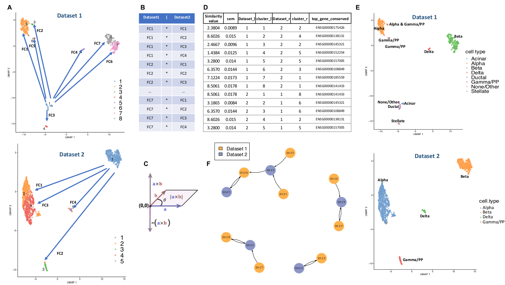
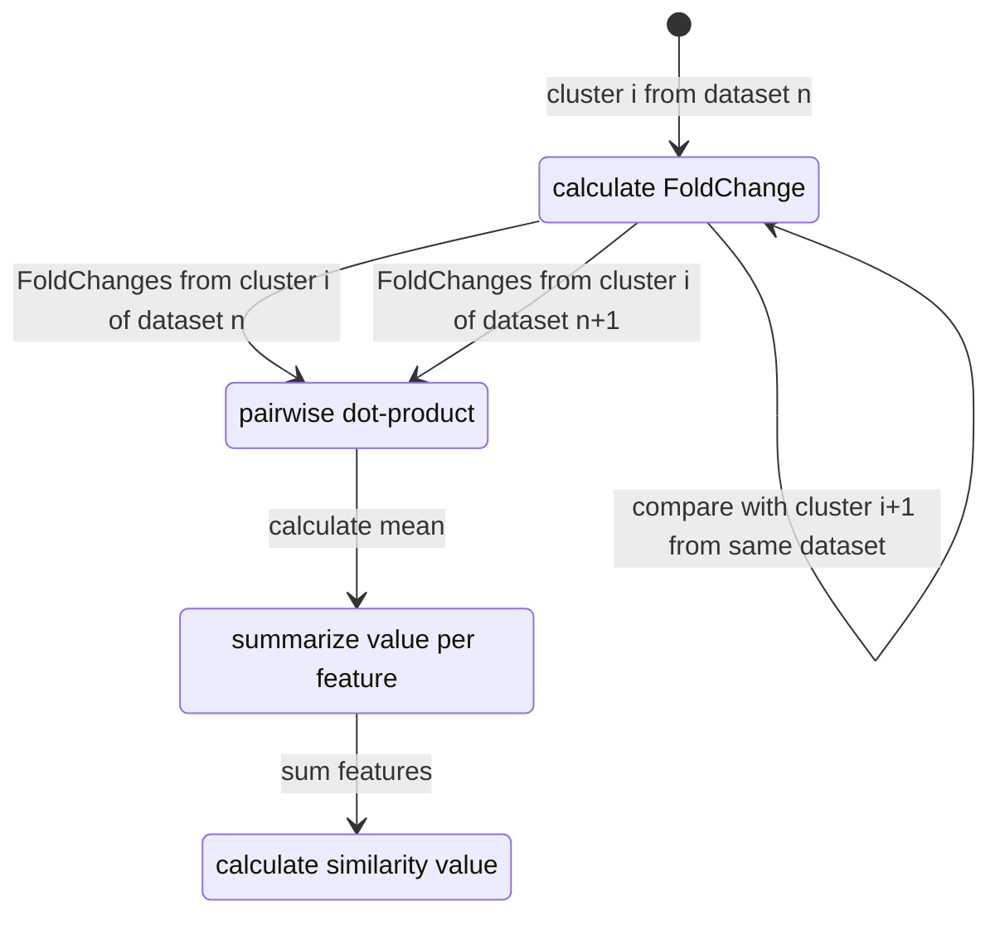

# ClusterFoldSimilarity
Calculate cluster similarity between clusters from different single cell datasets/batches/samples.

Full information about the method can be read on the original paper:

*A single-cell clusters similarity measure for different batches, datasets, and samples
Óscar González-Velasco, Elena Sanchez-Luis, Enrique De La Rosa, José M. Sanchez-Santos, Javier De Las Rivas
bioRxiv 2022.03.14.483731; doi: https://doi.org/10.1101/2022.03.14.483731*

This package is compatible with the most used single-cell objects: **Seurat** and **SingleCellExperiment**. 



*Figure: Pipeline representation of the similarity measurement done by ClusterFoldSimilarity. A:
Foldchanges (FC) are calculated between all possible combination of clusters for each dataset, figure
shows the FC calculation for cluster 1 in both datasets 1 and 2 in a UMAP corresponding with
pancreas cells. B: The scalar product of the computed FCs between all pairs is calculated. C:
Representation of the vectorial space of FCs and their product (in the graphic, a and b represent FCs
of a same gene between clusters), FC that points in the same direction will have positive product sign,
meanwhile opposite FC will have negative product sign. D: Table with the similarity values and output
information given by ClusterFoldSimilarity. E: UMAP representation of two pancreatic datasets with
annotated cell-types. Note that exact cell-type clusters are matched together by the table given at D. F:
Graph plot made by ClusterFoldSimilarity using the similarity values calculated (given at table D),
nodes correspond with clusters from a specific dataset, edges correspond with the similarity value,
arrows point in the direction of the similarity relationship.*

Installation
-----------------------------

1. The package can be installed from R software using devtools:
``` r
library(devtools)
install_github("OscarGVelasco/ClusterFoldSimilarity")
``` 
2. The package binaries are available for download on github:
https://github.com/OscarGVelasco/ClusterFoldSimilarity/blob/main/ClusterFoldSimilarity_0.99.0.tar.gz

Introduction
-----------------------------

Comparing single-cell data across different datasets, samples and batches has demonstrated to be challenging. `ClusterFoldSimilarity` aims to solve the complexity of comparing different single-cell data by calculating similarity scores between clusters (or user-defined groups) from two or more single-cell experiments. It does it by finding similar fold-change patterns across cell groups with a common set of features (e.g. genes). It also reports the top genes that contributed the most to the similarity value, acting as a feature selection tool.

`ClusterFoldSimilarity` can be used with single-cell RNA-Seq data, single-cell ATAC-Seq data, or more broadly, with continuous numerical data that shows signal changes across a set of common features from different groups. It is compatible with the most used single-cell objects: `r Biocpkg("Seurat")` and `r Biocpkg("SingleCellExperiment")`.

The output is a table that contains the similarity values for each pair of clusters from all datasets. `ClusterFoldSimilarity` also includes various plotting functions to help visualize the similarity scores.

Using ClusterFoldSimilarity to find similar clusters across datasets
-----------------------------

Typically `ClusterFoldSimilarity` will receive as input either a list of two or more `r Biocpkg("Seurat")` objects or a list of two or more `r Biocpkg("SingleCellExperiment")` objects, containing already processed data: e.g. filtered, normalized and clustered. (*PLEASE NOTE: this package is intended to be used with high-end-analyzed data, the better the pre-analysis the better the results `ClusterFoldSimilarity` will obtain, this includes: normalizing and taking care of local technical noise effects, removing non-variant data or selecting the top variant features, removing 0 expression features, reasonable number of clusters, etc.*)

`ClusterFoldSimilarity` will automatically look inside these objects for normalized data (`GetAssayData(assay, slot = "data")` and **cluster or label information** `Idents()` for `r Biocpkg("Seurat")` and `colLabels()` for `r Biocpkg("SingleCellExperiment")` ).

```{r construct }
library(Seurat)
library(scRNAseq)
# We will use the package scRNAseq that contains several single-cell datasets, including samples from mouse brain:
# Mouse brain single-cell RNA-seq 1 from Romanov et. al.
mouse.brain.romanov <- scRNAseq::RomanovBrainData(ensembl = T,location = F)
colnames(mouse.brain.romanov) <- colData(mouse.brain.romanov)$cellID
rownames(colData(mouse.brain.romanov)) <- colData(mouse.brain.romanov)$cellID
brain.sc.1.seurat <- CreateSeuratObject(counts = counts(mouse.brain.romanov),meta.data = as.data.frame(colData(mouse.brain.romanov)))
table(brain.sc.1.seurat@meta.data$level1.class)
# Mouse brain single-cell RNA-seq 2 from Zeisel et. al.
mouse.brain.zei <- scRNAseq::ZeiselBrainData(ensembl = T,location = F)
brain.sc.2.seurat <- CreateSeuratObject(counts = counts(mouse.brain.zei),meta.data = as.data.frame(colData(mouse.brain.zei)))
table(brain.sc.2.seurat@meta.data$level1class)

brain.sc.list <- list(brain.sc.1.seurat,brain.sc.2.seurat)

# Normalize and identify variable features for each dataset independently
# Note: these steps should be done tailored to each independent dataset, here we apply the same parameters for the sake of simplicity:
brain.sc.list <- lapply(X = brain.sc.list, FUN = function(x){
  x <- NormalizeData(x)
  x <- FindVariableFeatures(x, selection.method = "vst", nfeatures = 1000)
  x <- ScaleData(x,features = VariableFeatures(x))
  x <- RunPCA(x, features = VariableFeatures(object = x))
  x <- FindNeighbors(x, dims = 1:10)
  x <- FindClusters(x, resolution = 0.1)
})
```

Once we have all of our single-cell datasets analyzed independently, we can compute the similarity values. `cluster_fold_similarity()` takes as arguments:

  - `sce_list`: a list of single-cell objects (mandatory) either of class Seurat or of class SingleCellExperiment.
  - `top_n`: the top n most similar clusters to report from each pair of clusters (default: `1`, the top most similar cluster). If set to `Inf` it will return all the values from all the cluster-pairs.
  - `top_n_genes`: the top n genes that contributes to the similarity between the pair of clusters (default: `1`, the top contributing gene).

```{r}
library(ClusterFoldSimilarity)
similarity.table <- cluster_fold_similarity(sce_list = brain.sc.list,top_n = 1)
head(similarity.table)
```

By default, `cluster_fold_similarity()` will plot a graph network that visualizes the connections between the clusters from the different datasets; it can be useful for identifying relationships between groups of clusters and cell-populations that tend to be more similar.

In this example, as we have information regarding cell-type labels, we can check how the cell types match by calculating the most abundant cell type on each of the similar clusters:

```{r}
apply(similarity.table[similarity.table$dataset_l == 1,],1,function(x){
  n1 = names(which.max(table(brain.sc.list[[as.numeric(x["dataset_l"])]]@meta.data[brain.sc.list[[as.numeric(x["dataset_l"])]]@meta.data$seurat_clusters == x["cluster_l"],"level1.class"])))
  n2 = names(which.max(table(brain.sc.list[[as.numeric(x["dataset_r"])]]@meta.data[brain.sc.list[[as.numeric(x["dataset_r"])]]@meta.data$seurat_clusters == x["cluster_r"],"level1class"])))
  return(paste("dataset 1 cluster",x["cluster_l"],"top cell.type:",n1,"VS dataset 2 cluster",x["cluster_r"],"top cell.type:",n2))
  })
```

If we suspect that clusters could be related with more than one cluster of other datasets, we can retrieve the top n similarities for each cluster: 

```{r}
similarity.table.3top <- cluster_fold_similarity(sce_list = brain.sc.list,top_n = 3)
head(similarity.table.3top)
```

If we are interested on the features that contribute to the similarity, we can retrieve the top n features: 

```{r}
similarity.table.10top.features <- cluster_fold_similarity(sce_list = brain.sc.list,top_n_genes = 10)
head(similarity.table.10top.features)
```

Retrieving all the similarity values
-----------------------------

Sometimes it is useful to retrieve all the similarity values for downstream analysis (e.g. identify more than one cluster that is similar to a cluster of interest, finding the most dissimilar clusters, etc).

```{r}
similarity.table <- cluster_fold_similarity(sce_list = brain.sc.list,top_n = Inf)
dim(similarity.table)
```

It can be convenient to create a matrix with all the similarity values from the comparison of two datasets:

```{r}
dataset1= 1
dataset2= 2
similarity.table.2 <- similarity.table %>% filter(dataset_l == dataset1 & dataset_r == dataset2) %>% arrange(desc(as.numeric(cluster_l)),as.numeric(cluster_r))
cls <- unique(similarity.table.2$cluster_l)
cls2 <- unique(similarity.table.2$cluster_r)
similarity.table.all <- t(matrix(similarity.table.2$similarity_value,ncol=length(unique(similarity.table.2$cluster_l))))
rownames(similarity.table.all) <- cls
colnames(similarity.table.all) <- cls2
similarity.table.all
```

Similarity score calculation
-----------------------------

`ClusterFoldSimilarity` does not need to merge or harmonize the data across the datasets that we aim to analyze, which makes it less prone to data-loss or noise, and that is typical of some of these methods.


