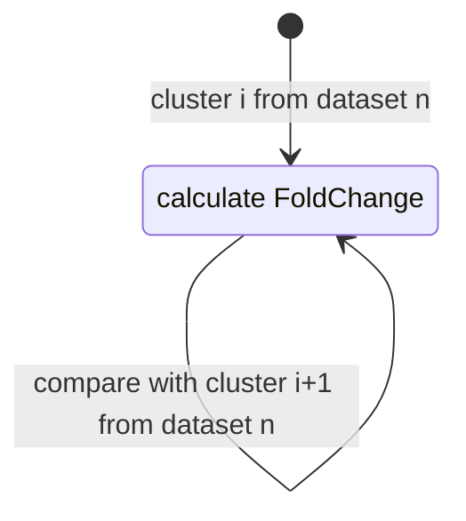
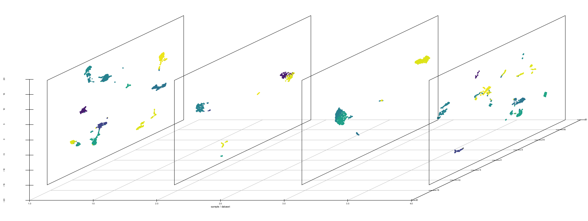

# ClusterFoldSimilarity
Calculate cluster similarity between clusters from different single cell datasets/batches/samples.

Full information about the method can be read on the original paper:

*A single-cell clusters similarity measure for different batches, datasets, and samples
Óscar González-Velasco, Elena Sanchez-Luis, Enrique De La Rosa, José M. Sanchez-Santos, Javier De Las Rivas
bioRxiv 2022.03.14.483731; doi: https://doi.org/10.1101/2022.03.14.483731*

This package is compatible with the most used single-cell objects: **Seurat** and **SingleCellExperiment**. 




*Figure: Pipeline representation of the similarity measurement done by ClusterFoldSimilarity. A:
Foldchanges (FC) are calculated between all possible combination of clusters for each dataset, figure
shows the FC calculation for cluster 1 in both datasets 1 and 2 in a UMAP corresponding with
pancreas cells. B: The scalar product of the computed FCs between all pairs is calculated. C:
Representation of the vectorial space of FCs and their product (in the graphic, a and b represent FCs
of a same gene between clusters), FC that points in the same direction will have positive product sign,
meanwhile opposite FC will have negative product sign. D: Table with the similarity values and output
information given by ClusterFoldSimilarity. E: UMAP representation of two pancreatic datasets with
annotated cell-types. Note that exact cell-type clusters are matched together by the table given at D. F:
Graph plot made by ClusterFoldSimilarity using the similarity values calculated (given at table D),
nodes correspond with clusters from a specific dataset, edges correspond with the similarity value,
arrows point in the direction of the similarity relationship.*

Installation
-----------------------------

1. The package can be installed from R software using devtools:
``` r
library(devtools)
install_github("OscarGVelasco/ClusterFoldSimilarity")
``` 
2. The package binaries are available for download on github:
https://github.com/OscarGVelasco/ClusterFoldSimilarity/blob/main/ClusterFoldSimilarity.tar.gz

# Example using pancreatic scRNA-Seq
-----------------------------
We will use **a set of single-cell RNA-Seq transcriptomic data from human pancreatic samples** included on the R Bioconductor package **scRNAseq** (Risso D, C. M. (2021). scRNAseq: Collection of Public Single-Cell RNA-Seq Datasets. R package version 2.8.0.)*
1) GSE84133 *(Baron et al., 2016)*, 2) GSE86469 *(Lawlor et al., 2017)*, 3) GSE81608 *(Xin et al.,2016)*, 4) ArrayExpress: E-MTAB-5061 *(Segerstolpe et al., 2016)*.

The four selected datasets contain metadata specifing the cell-type of each barcoded cell on the dataset.

``` r
library(Seurat)
library(scRNAseq)

pancreas_baron <- scRNAseq::BaronPancreasData(which = "human",ensembl = T)
table(colData(pancreas_baron)$label)
table(colData(pancreas_baron)$donor)

pancreas_lawlor <- scRNAseq::LawlorPancreasData()
table(colData(pancreas_lawlor)[,"cell type"])

pancreas_xin <- scRNAseq::XinPancreasData(ensembl = T)
assayNames(pancreas_xin) <- "counts"
table(colData(pancreas_xin)$cell.type)

pancreas_segers <- scRNAseq::SegerstolpePancreasData(ensembl = T)
assayNames(pancreas_segers)
```

## Normalize data, Feature selection, Dimensionality reduction and Clustering
For ClusterFoldSimilarity to run, we need to handle it the normalized counts and the cluster membership of each cell.
Here is an example code that we need to run for each of the four datasets showed above.
It is recommended to filter by most important features (e.g. high variable genes, markers...).

``` r
####################################
library(scran)
sce.ad <- MySingleCellExperiment
``` 
### 1. Normalization
``` r
lib.sce.ad <- librarySizeFactors(sce.ad)
set.seed(100)
clust.sce.ad <- quickCluster(sce.ad) # Normalization by deconvolution to account for different cell type variability
table(clust.sce.ad)
# We choose the deconvolutional factor normalization method, we use the computed clusters to calculate the sizefactors
sce.ad <- computeSumFactors(sce.ad, cluster=clust.sce.ad, min.mean=0.1)
sce.ad <- logNormCounts(sce.ad) # Calculate the log normalized matrix
``` 
### 2. Feature-Selection
``` r
# Plotting gene variability across cells
dec.sce.feature <- modelGeneVar(sce.ad)
# Visualizing the fit:
fit.ad.sce <- metadata(dec.sce.feature)
plot(fit.ad.sce$mean, fit.ad.sce$var,main="Gene variability per cell", xlab="Mean of log-expression",
     ylab="Variance of log-expression")
curve(fit.ad.sce$trend(x), col="dodgerblue", add=TRUE, lwd=2)
# Taking the top 2000 genes here:
hvg.ad.var.top <- getTopHVGs(dec.sce.feature, n=1000)
``` 
### 3. Dimensionality Reduction
``` r
import(scater)
# By top genes
sce.ad.pca.top <- sce.ad[hvg.ad.var.top,]
sce.ad.pca.top <- runPCA(sce.ad.pca.top) 
percent.var <- attr(reducedDim(sce.ad.pca.top), "percentVar")
n.selected <- 25
title <- paste("Selected number of principal components: ",n.selected," \n Total variance explained: ",round(sum(percent.var[1:n.selected]),digits = 2),"%",sep = "")
plot(percent.var,main= title,log="y", xlab="PC", ylab="Variance explained (%)",col=c(rep("blue",n.selected),rep("red",length(percent.var)-n.selected)))
# Choose number of PCs
reducedDim(sce.ad.pca.top) <- reducedDim(sce.ad.pca.top)[,1:n.selected]
# UMAP dim. reduction
sce.ad.pca.top <- runUMAP(sce.ad.pca.top, dimred="PCA")
plotUMAP(sce.ad.pca.top, colour_by="cell type",text_by="cell type")
``` 
### 4. Clustering cell communities
``` r
# Graph clustering
sce.ad.pca <- sce.ad.pca.top # Select subset
library(bluster)
kgraph.clusters <- clusterRows(reducedDim(sce.ad.pca, "PCA"),
                               TwoStepParam(
                                 first=KmeansParam(centers=60),
                                 second=NNGraphParam(k=2)
                               )
)
table(kgraph.clusters)
colLabels(sce.ad.pca) <- factor(kgraph.clusters)
cluster_umap <- plotUMAP(sce.ad.pca, colour_by=I(kgraph.clusters),text_by=I(kgraph.clusters)) + 
  ggtitle("UMAP of sample using NNGraph and Kmeans clustering")
plotUMAP(sce.ad.pca, colour_by="cell type",text_by="cell type") + 
  ggtitle("UMAP of sample using NNGraph and Kmeans clustering")
print(cluster_umap)
``` 

### Create a list of single-cell experiments and run ClusterFoldSimilarity
``` r
# We add the previous single-cell experiments to a list.
sce_list <- list(...)
similarity.table <- ClusterFoldSimilarity::cluster_fold_similarity(sce_list = sce_list)
```
## Multi-dimReduction plot using ClusterFoldSimilarity
The tool is able to produce a plot of multiple dimensionality reductions plots (PCA,UMAP,tSNE) of the single-cell experiments using a color code guided by the similarity measure calculated in the previous steps.
*We need to provide to the function **multi_cluster_plot()** with the **similarity.table** calculated in the previous step by ClusterFoldSimilarity()*
``` r
ClusterFoldSimilarity::multi_cluster_plot(sce_list = sce_list,similarity_table = similarity.table,dim_method="UMAP")
```

