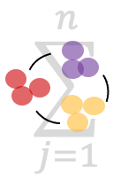

<h1> ClusterFoldSimilarity</h1>

Calculate similarities between cell-groups/clusters from any number of independent single-cell experiments, without data integration or batch correction.

### Citation

> Oscar González-Velasco, Malte Simon, Rüstem Yilmaz, Rosanna Parlato, Jochen Weishaupt, Charles D. Imbusch, Benedikt Brors, Identifying similar populations across independent single cell studies without data integration, NAR Genomics and Bioinformatics, Volume 7, Issue 2, June 2025, lqaf042, https://doi.org/10.1093/nargab/lqaf042

# Installation

The package can be installed from R software using devtools:

```{r eval=FALSE}
library(devtools)
install_github("OscarGVelasco/ClusterFoldSimilarity")
```

### Updates:
- May 2024: added new feature `findCommunitiesSimmilarity` function, which allows finding communities on the similarity graph by clustering nodes using Leiden algorithm. This function plots the graph with the communities color-coded and returns a data frame with the results.

# Introduction

Comparing single-cell data across different datasets, samples and batches has demonstrated to be challenging. `ClusterFoldSimilarity` aims to solve the complexity of comparing different single-cell datasets by computing similarity scores between clusters (or user-defined groups) from any number of independent single-cell experiments, including different species and sequencing technologies. It accomplishes this by identifying analogous fold-change patterns across cell groups that share a common set of features (such as genes). Additionally, it selects and reports the top important features that have contributed to the observed similarity, serving as a tool for feature selection.

The output is a table that contains the similarity values for all the combinations of cluster-pairs from the independent datasets. `ClusterFoldSimilarity` also includes various plotting utilities to enhance the interpretability of the similarity scores.

### Cross-species analysis and sequencing technologies (e.g.: Human vs Mouse, ATAC-Seq vs RNA-Seq)

`ClusterFoldSimilarity` is able to compare **any number** of independent experiments, including **different organisms**, making it useful for matching cell populations across different organisms, and thus, useful for inter-species analysis. Additionally, it can be used with **single-cell RNA-Seq data, single-cell ATAC-Seq data**, or more broadly, with continuous numerical data that shows changes in feature abundance across a set of common features between different groups.

### Compatibility

It can be easily integrated on any existing single-cell analysis pipeline, and it is compatible with the most used single-cell objects: `Seurat` and `SingleCellExperiment`.

Parallel computing is available through the option parallel=TRUE which make use of BiocParallel.

# Using ClusterFoldSimilarity to find similar clusters/cell-groups across datasets

Typically, `ClusterFoldSimilarity` will receive as input either a list of two or more `Seurat` or `SingleCellExperiment` objects.

`ClusterFoldSimilarity` will obtain the **raw count data** from these objects ( `GetAssayData(assay, slot = "counts")` in the case of `Seurat`, or `counts()` for `SingleCellExperiment` object), and **group or cluster label information** (using `Idents()` function from `Seurat`, or `colLabels()` for `SingleCellExperiment` ).

For the sake of illustration, we will employ the scRNAseq package, which contains numerous individual-cell datasets ready for download and encompassing samples from both human and mouse origins. In this example, we specifically utilize 2 human single-cell datasets obtained from the pancreas.

```{r construct }
library(Seurat)
library(scRNAseq)
library(dplyr)
# Human pancreatic single cell data 1
pancreas_muraro <- scRNAseq::MuraroPancreasData(ensembl = F)
table(colData(pancreas_muraro)$label); dim(pancreas_muraro)
pancreas_muraro <- pancreas_muraro[,rownames(colData(pancreas_muraro)[!is.na(colData(pancreas_muraro)$label),])]
colData(pancreas_muraro)$cell.type <- colData(pancreas_muraro)$label
rownames(pancreas_muraro) <- unlist(lapply(strsplit(rownames(pancreas_muraro),split = "__"),function(x)x[[1]]))
singlecell.1.seurat <- Seurat::CreateSeuratObject(counts = counts(pancreas_muraro),meta.data = as.data.frame(colData(pancreas_muraro)))

# Human pancreatic single cell data 2
pancreas_baron <- scRNAseq::BaronPancreasData(which = "human",ensembl = F)
table(colData(pancreas_baron)$label); dim(pancreas_baron)
colData(pancreas_baron)$cell.type <- colData(pancreas_baron)$label
singlecell.2.seurat <- Seurat::CreateSeuratObject(counts = counts(pancreas_baron),meta.data = as.data.frame(colData(pancreas_baron)))

```

As we want to perform clustering analysis for later comparison of these cluster groups using `ClusterFoldSimilarity`, we first need to normalize and identify variable features for each dataset independently.

*Note: these steps should be done tailored to each independent dataset, here we apply the same parameters for the sake of simplicity:*

```{r}
# Create a list with the unprocessed single-cell datasets
singlecell.object.list <- list(singlecell.1.seurat,singlecell.2.seurat)
# Apply the same processing to each dataset and return a list of single-cell analysis
singlecell.object.list <- lapply(X = singlecell.object.list, FUN = function(x){
x <- NormalizeData(x)
x <- FindVariableFeatures(x, selection.method = "vst", nfeatures = 2000)
x <- ScaleData(x,features = VariableFeatures(x))
x <- RunPCA(x, features = VariableFeatures(object = x))
x <- FindNeighbors(x, dims = seq(16))
x <- FindClusters(x, resolution = 0.4)
})
```

Once we have all of our single-cell datasets analyzed independently, we can compute the similarity values. `clusterFoldSimilarity()` takes as arguments:

-   `scList`: a list of single-cell objects (mandatory) either of class `Seurat` or of class `SingleCellExperiment`.
-   `sampleNames`: vector with names for each of the datasets. If not set the datasets will be named in the given order as: *1, 2, ..., N*.
-   `topN`: the top n most similar clusters/groups to report for each cluster/group (default: `1`, the top most similar cluster). If set to `Inf` it will return the values from all the possible cluster-pairs.
-   `topNFeatures`: the top *n* features (e.g.: genes) that contribute to the observed similarity between the pair of clusters (default: `1`, the top contributing gene). If a negative number, the tool will report the *n* most dissimilar features.
-   `nSubsampling`: number of subsamplings (1/3 of cells on each iteration) at group level for calculating the fold-changes (default: `15`). At start, the tool will report a message with the recommended number of subsamplings for the given data (average n of subsamplings needed to observe all cells).
-   `parallel`: whether to use parallel computing with multiple threads or not (default: `FALSE`). If we want to use a specific single-cell experiment for annotation (from which we know a ground-truth label, e.g. cell type, cell cycle, treatment... etc.), we can use that label to directly compare the single-cell datasets.

Here we will use the annotated pancreas cell-type labels from the dataset 1 to illustrate how to match clusters to cell-types using a reference dataset:

```{r}
# Assign cell-type annotated from the original study to the cell labels:
Idents(singlecell.object.list[[1]]) <- factor(singlecell.object.list[[1]][[]][,"cell.type"])

library(ClusterFoldSimilarity)
# Compute similarities
similarity.table <- clusterFoldSimilarity(scList = singlecell.object.list, 
                                          sampleNames = c("human","human.NA"),
                                          topN = 1, 
                                          nSubsampling = 24)
head(similarity.table)
```

A data.frame with the results is returned containing:

-   `similarityValue`: The top similarity value calculated between datasetL:clusterL and datasetR.
-   `w`: Weight associated with the similarity score value.
-   `datasetL`: Dataset left, the dataset/sample which has been used to be compared. 
-   `clusterL`: Cluster left, the cluster source from datasetL which has been compared.
-   `datasetR`: Dataset right, the dataset/sample used for comparison against datasetL.
-   `clusterR`: Cluster right, the cluster target from datasetR which is being compared with the clusterL from datasetL.
-   `topFeatureConserved`: The features (e.g.: genes, peaks...) that most contributed to the similarity between clusterL & clusterR.
-   `featureScore`: The similarity score contribution for the specific topFeatureConserved (e.g.: genes, peaks...).

By default, `clusterFoldSimilarity()` will plot a graph directed network that visualizes the connections between the clusters from the different datasets using the similarity table that has been obtained. The arrows point in the direction of the similarity (datasetL:clusterL -\> datasetR:clusterR); it can be useful for identifying relationships between groups of clusters and cell-populations that tend to be more similar. The graph plot can also be obtained by using the function `plotClustersGraph()` from this package, using as input the similarity table.

In this example, as we have information regarding cell-type labels, we can check how the cell types match by calculating the most abundant cell type on each of the similar clusters:

```{r}
type.count <- singlecell.object.list[[2]][[]] %>% 
  group_by(seurat_clusters) %>% 
  count(cell.type) %>%
  arrange(desc(n), .by_group = TRUE) %>% 
  filter(row_number()==1)

cbind.data.frame(type.count, 
                 matched.type = rep(table(type.count$seurat_clusters), x = similarity.table[similarity.table$datasetL == "human.NA",]$clusterR))
```

## Analyzing graph communities to identify super-groups of similar cell populations

To easily analyze and identify the similarities between the different datasets and cell-groups, we can find the communities that constitute the directed graph (cluster the nodes based on the graph´s closely-related elements).

We can make so by using the function `findCommunitiesSimmilarity()` from the `ClusterFoldSimilarity` package. It uses the Leiden clustering algorithm to find the best fitting communities. We just need the similarity table obtained from `clusterFoldSimilarity()` as explained on the previous section, the function will plot the graph with the communities and return a data frame containing the community that each sample & cluster/group belongs to. We can also adjust the granularity of the clustering.

```{r}
cell.communities <- findCommunitiesSimmilarity(similarityTable = similarity.table)

head(cell.communities)
```

## Retrieving the top-n similarities

If we suspect that clusters could be related with more than one cluster of other datasets, we can retrieve the top n similarities for each cluster:

```{r}
# Retrieve the top 3 similar cluster for each of the clusters:
similarity.table.3top <- clusterFoldSimilarity(scList = singlecell.object.list, 
                                               topN = 3, # Obtain top 3 values
                                               sampleNames = c("human","human.NA"), 
                                               nSubsampling = 24)
head(similarity.table.3top)
```

## Obtaining the top-n feature markers

If we are interested on the features that contributed to the similarity score (most important feature markers), we can retrieve the top n:

```{r}
# Retrieve the top 5 features that contribute the most to the similarity between each pair of clusters:
similarity.table.5top.features <- clusterFoldSimilarity(scList = singlecell.object.list, 
                                                        topNFeatures = 5, 
                                                        nSubsampling = 24)
head(similarity.table.5top.features, n=10)
```

## Retrieving all the similarity values and plotting a similarity heatmap

Sometimes it is useful to retrieve all the similarity values for downstream analysis (e.g. identify more than one cluster that is similar to a cluster of interest, finding the most dissimilar clusters, etc). To obtain all the values, we need to specify `topN=Inf`.

By default, `clusterFoldSimilarity` creates a heatmap plot with the computed similarity values (from the perspective of the first dataset found on `scList`; to modify this plot see the following section). The top 2 similarities for each group within dataset 1 (heatmap row-wise) are highlighted with colored borders.

```{r}
similarity.table.all.values <- clusterFoldSimilarity(scList = singlecell.object.list, 
                                                     sampleNames = c("human","human.NA"), 
                                                     topN = Inf)
dim(similarity.table.all.values)
```

For downstream analysis of the similarities, it can be convenient to create a matrix with all the scores from the comparison of two datasets:

```{r}
library(dplyr)
dataset1 <- "human"
dataset2 <- "human.NA"
similarity.table.2 <- similarity.table.all.values %>% 
filter(datasetL == dataset1 & datasetR == dataset2) %>% 
arrange(desc(as.numeric(clusterL)), as.numeric(clusterR))
cls <- unique(similarity.table.2$clusterL)
cls2 <- unique(similarity.table.2$clusterR)
similarity.matrix.all <- t(matrix(similarity.table.2$similarityValue, ncol=length(unique(similarity.table.2$clusterL))))
rownames(similarity.matrix.all) <- cls
colnames(similarity.matrix.all) <- cls2
similarity.matrix.all
```

# Using ClusterFoldSimilarity across species and numerous datasets:

`ClusterFoldSimilarity` can compare **any number** of independent studies, including **different organisms**, making it useful for inter-species analysis. Also, it can be used on different sequencing data technologies: e.g.: compare single-cell **ATAC-Seq vs RNA-seq**.

In this example, we are going to add a pancreas single-cell dataset from **Mouse** to the 2 existing ones from **Human** that we have processed in the previous steps.

```{r}
# Mouse pancreatic single cell data
pancreas_baron_mm <- scRNAseq::BaronPancreasData(which = "mouse",ensembl = F)
table(colData(pancreas_baron_mm)$label); dim(pancreas_baron_mm)
colData(pancreas_baron_mm)$cell.type <- colData(pancreas_baron_mm)$label
# Translate mouse gene ids to human ids
# *for the sake of simplicity we are going to transform to uppercase all mouse gene names
rownames(pancreas_baron_mm) <- toupper(rownames(pancreas_baron_mm))
# Create seurat object
singlecell.3.seurat <- CreateSeuratObject(counts = counts(pancreas_baron_mm),meta.data = as.data.frame(colData(pancreas_baron_mm)))

# We append the single-cell object to our list
singlecell.object.list[[3]] <- singlecell.3.seurat

```

Now, we process the new single-cell dataset from mouse, and we calculate the similarity scores between the 3 independent datasets.

This time we will make use of the option parallel=TRUE. We can set the specific number of CPUs to use using `BiocParallel::register()`

```{r}

x <- singlecell.object.list[[3]]
x <- NormalizeData(x)
x <- FindVariableFeatures(x, selection.method = "vst", nfeatures = 2000)
x <- ScaleData(x,features = VariableFeatures(x))
x <- RunPCA(x, features = VariableFeatures(object = x))
x <- FindNeighbors(x, dims = seq(16))
x <- FindClusters(x, resolution = 0.4)
singlecell.object.list[[3]] <- x

# We use the cell labels as a second reference, but we can also use the cluster labels if our interest is to match clusters
Idents(singlecell.object.list[[3]]) <- factor(singlecell.object.list[[3]][[]][,"cell.type"])

# We subset the most variable genes in each experiment
singlecell.object.list.variable <- lapply(singlecell.object.list, function(x){x[VariableFeatures(x),]})

# Setting the number of CPUs with BiocParallel:
BiocParallel::register(BPPARAM =  BiocParallel::MulticoreParam(workers = 6))

similarity.table.human.mouse <- clusterFoldSimilarity(scList = singlecell.object.list.variable,
                                                        sampleNames = c("human","human.NA","mouse"),
                                                        topN = 1, 
                                                        nSubsampling = 24,
                                                        parallel = TRUE)
```

We can compute and visualize with a heatmap all the similarities for each cluster/group of cells from the 3 datasets using `topN=Inf`. Additionally, we can use the function `similarityHeatmap()` from this package to plot the heatmap with the datasets in a different order, or just plot the 2 datasets we are interested in. The top 2 similarities are highlighted to help visualizing the best matching groups.

```{r}
similarity.table.human.mouse.all <- clusterFoldSimilarity(scList = singlecell.object.list.variable,
                                                          sampleNames = c("human","human.NA","mouse"),
                                                          topN = Inf, 
                                                          nSubsampling = 24,
                                                          parallel = TRUE)
```

As the similarity values might not be symmetric (e.g. a cluster A from D1 showing the top similarity to B from D2, might not be the top similar cluster to B from D2), we can select which dataset to plot in the Y-axis:

```{r}
ClusterFoldSimilarity::similarityHeatmap(similarityTable=similarity.table.human.mouse.all, 
                                          mainDataset="human.NA")
```

Additionally, we can turn-off the highlight using `highlightTop=FALSE`

```{r}
# Turn-off the highlighting:
ClusterFoldSimilarity::similarityHeatmap(similarityTable=similarityTableHumanMouseAll, 
                                          mainDataset="humanNA",
                                          highlightTop=FALSE)
```

# Similarity score calculation

`ClusterFoldSimilarity` does not need to integrate the data, or apply any batch correction techniques across the datasets that we aim to analyze, which makes it less prone to data-loss or noise. The similarity value is based on the fold-changes between clusters/groups of cells defined by the user. These fold-changes from different independent datasets are first computed using a Bayesian approach, we calculate this fold-change distribution using a permutation analysis that srink the fold-changes with no biological meaning. These differences in abundance are then combined using a pairwise dot product approach, after adding these feataure contributions and applying a fold-change concordance weight, a similarity value is obtained for each of the clusters of each of the datasets present.
